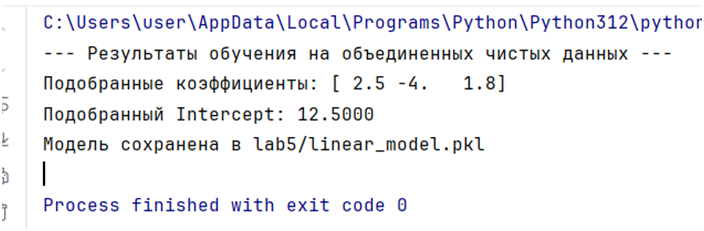
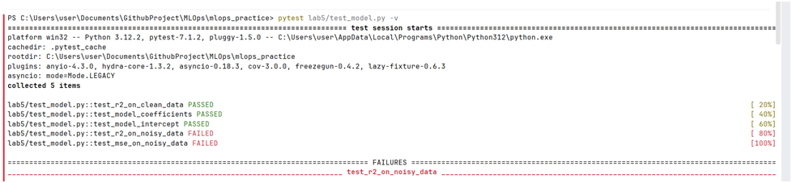
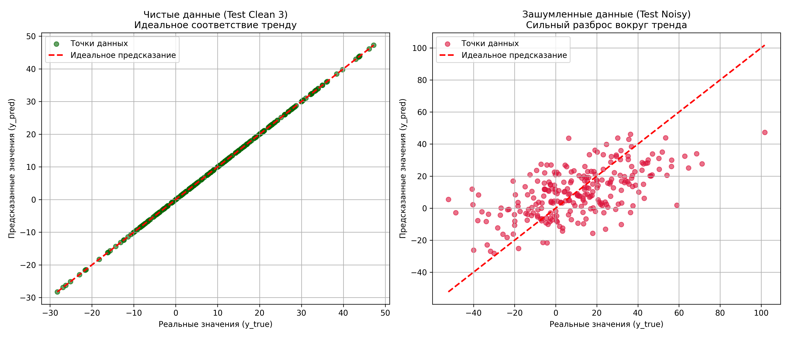

## Выполнение лабораторной работы

1. Скрипт генерации данных: data_creation.py 
2. Было создано три чистых датасета и один с шумом, которые сохранены в папке lab5 
3. Все данные строятся вокруг однго тренда:
$$y = 2.5x_1 - 4x_2 + 1.8x_3 + 12.5$$
4. test_noisy.csv: Была взята структура третьего датасета к которому добавили случайный шум (np.random.normal).
5. Скрипт для тренировки модели: train_model.py

6. Скрипт автоматического тестирования модели: test_model.py
7. Тесты test_model_coefficients и test_model_intercept: сверяют выученные моделью коэффициенты с нашей  формулой. Если разница больше погрешности, то тест упадет.
8. test_r2_on_clean_data проверяет, что на новых качественных данных метрика коэффициент детерминации стремится к единице.
9. test_r2_on_noisy_data и test_mse_on_noisy_data: проверяют поведение модели на грязных данных. В итоге, данные тесты упали, так как модель сильно деградировала.

10. Визуализация данных. На чистых данных график демонстрирует идеальную линейную зависимость, а на шумных - деградацию модели :
